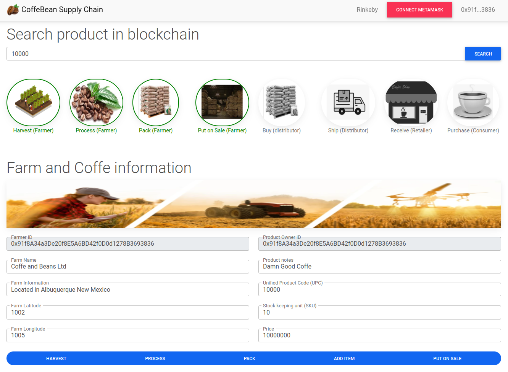

# COFFEBEANCHAIN - Supply Chain in Ethereum
Coffe Bean supply chain DApp Implemented on the ethereum network

## Introduction 
THe application allows to simulate a simple supply chain related to the coffe bean processing. It allows interacting four different actors: Farmer, Distributor, Retailer and Consumers with a decentralized app based on REACT for the frontend and a series of smart contracts running on ethereum as the backend.


DApp developed for the 3rd project of Udacity's Blockchain Developer Nanodegree:



In previous screenshot the coffe is already harvested, processed, packed and put for sale. Nonetheless the product it's still property of the farmer. Therefore product owner and farm ID matches as it can be seen in previous image.

After the coffe navigates trought the rest of the supply chain (see below in this README the already registered transactions in rinbey), the property of the product will change from the farmer to the distribuitor, to the reatailer and finally to the consumer.

This is how it would look like after the process is completed:


This DApp is alredy **deployed on the rinkeby network**:
- **Contract owner and has all roles**: https://rinkeby.etherscan.io/address/0x91f8A34a3De20f8E5A6BD42f0D0d1278B3693836
- Smart Contract Deployments:
    - Migrations: https://rinkeby.etherscan.io/address/0x3156cf6C980a1a2ca5d3481F79516AaEAE2f97D7
    - **SupplyChain**: https://rinkeby.etherscan.io/address/0x54Fb0500325447163dcb3F17550aD1e2D01CB0a1

- Total cost of deployment: 0.04772206 ETH

- Transactions already registered
    - By Farmer: 0x91f8A34a3De20f8E5A6BD42f0D0d1278B3693836
        - Harvest: https://rinkeby.etherscan.io/tx/0x8030a76e61f40f5e3be6e9e4d8caee87f289ddcdd30045d7b9142d6b0c2d8501       (UPC-10000)
        - Process: https://rinkeby.etherscan.io/tx/0x39fd1b1f820706049e91ffe2585e444f7a9430601be204584020b6cab7e63cd3       (UPC-10000)
        - Pack: https://rinkeby.etherscan.io/tx/0x2009cca708727bacfeeb0eefb274cc45eeb3808afeae2af6bdf56d3aaea5407d          (UPC-10000)
        - AddItem: https://rinkeby.etherscan.io/tx/0x504bf8db42481eae39f992d257718d20b2b2f71ad06abe7050a64bb6da12f6e5       (UPC-10000)
        - PutForSale: https://rinkeby.etherscan.io/tx/0x1d61f757b27c5d845da23a8b5ee8f55e4be7160e762993fae95c8bfb1730bfa0    (UPC-10000)
    
    - By Distributor: 0xddbf200aa634dc3fb81cfd68583dd1040d1c751d335e1d86b631bde3e977fea8
        - First product owner should call addDistributor to assign the roles to previous address: https://rinkeby.etherscan.io/tx/0x61c596e566e9d9cc7d41b3d2ae5444ec025f7759ad25278f54d860bc63e404ad
        - Buy: https://rinkeby.etherscan.io/tx/0x8c6c86b43b10286bc21769b76bce50ff7631e3d978369374422636053e44799c
        - Ship: https://rinkeby.etherscan.io/tx/0xac0bd37eb54a6b6090f030bb2ca959e31f8a6ec27be877842c9130dc2fb8db92
    
    - By Retailer:
        - First product owner should call addRetailer to assign the roles to previous address: https://rinkeby.etherscan.io/tx/0xb897f048af9b524a7eefe3ab22d886df43703eb079bfef432f4323dace5d721e
        - Receive: https://rinkeby.etherscan.io/tx/0xfc9e88bfa4770bbeb4353f1acae059b2233a74ae1c05fef2a362a25ffac37356
    
    - By Consumer:
        - First product owner should call addConsumer to assign the roles to previous address: https://rinkeby.etherscan.io/tx/0x1a0407ff8938c211a353fbe0d186eaf988ba48f3c2bc1cbcdce93def1b9411a8  
        - Purchase: https://rinkeby.etherscan.io/tx/0x612e83e97a2308a8c2605555199f9c371897fb3bb3706fd4f69d5d1dfcdfe518

## DEPENDENCIES

## Backend (smart contract):
This project has been implemented with following versions of truffle and solidity
- Truffle - v5.5.25 (core: 5.5.25)
- Solidity - 0.8.16 (solc-js)

The dependencies identified in package.json are:
- "dotenv": "^16.0.1"                       (to handle .env files for the Infura configuration)
- "truffle-hdwallet-provider": "^1.0.17"    (to deploy contracts into the Rinkeby network via Infura)
- "truffle-assertions": "^0.9.2"            (to check for smart contract events emitted in tests)

## Frontend (web)
- "react": "^18.1.0",
- "react-dom": "^18.1.0",
- "react-scripts": "^4.0.3",
- "web3": "^1.7.3"
- "@testing-library/jest-dom": "^5.16.4",
- "@testing-library/react": "^13.2.0",
- "@testing-library/user-event": "^13.5.0",

## UML

- Activity UML:


- Sequence UML:


- State UML:


- Class UML:


## DEPLOYMENT

### Download
To download the repository
```
\downloads\git clone https://github.com/IsmaelB83/CoffeBeanChain.git
```

### Install dependencies

Install all the required npm packages both in backend and frontend folders
```
\downloads\CoffeBeanChain\npm install
\downloads\CoffeBeanChain\app\npm install
```
### Configuration
- Before deploying the network to any ethereum network, you need to provide an .env file with the parameters to connect trough infura. You just need three parameters as shown in .env.example:
INFURA_KEY='abcde'
INFURA_SECRET='abcde'
MNEMONIC='mnemonic of your wallet with funds'

### Deploy backend
- Test contracts
```
\downloads\CoffeBeanChain\truffle\truffle develop
truffle(develop)> test
```

- Migrate contracts to rinkeby network
```
\downloads\CoffeBeanChain\truffle\truffle migrate --reset --network rinkeby
```

## Start Frontend
To start the frontend in dev environment 
```
\downloads\CoffeBeanChain\client\npm start
```

## DEMO
PENDING