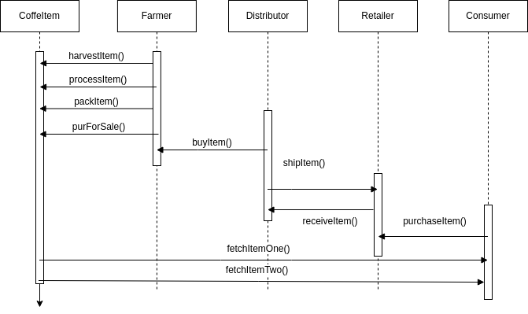

# COFFEBEANCHAIN - Supply Chain in Ethereum
Coffe Bean supply chain DApp Implemented on the ethereum network

## Introduction 
DApp developed for the 3rd project of Udacity's Blockchain Developer Nanodegree.

The application allows to simulate a simple supply chain related to the coffe bean processing. It allows interacting four different actors: Farmer, Distributor, Retailer and Consumers with a decentralized app based on REACT for the frontend and a series of smart contracts running on ethereum as the backend.


See the **UML diagrams** here: [UML Files](##-UML)

This DApp is alredy **deployed on the rinkeby network**:
- **Account owner**: https://rinkeby.etherscan.io/address/0x91f8A34a3De20f8E5A6BD42f0D0d1278B3693836
- Smart Contract Deployments:
    - Migrations: https://rinkeby.etherscan.io/address/0x25E9e9BF0fDA0AAD0BB0A15265A4a9d13C751658
    - **FarmerRole**: https://rinkeby.etherscan.io/address/0x38ad00AFd649313f96caA321867A16daf57adcCA
    - **DistributorRole**: https://rinkeby.etherscan.io/address/0xE6cdD6B729159DdC0A5B067caDC3a98781D9A2BF
    - **RetailerRole**: https://rinkeby.etherscan.io/address/0xB002cA7e14f3723578d277272577a34C5Fb06d00
    - **ConsumerRole**: https://rinkeby.etherscan.io/address/0xdc1efeCC8A40260ee8A2b1Ca2dc154e84886B060
    - **SupplyChain**: https://rinkeby.etherscan.io/address/0xB8e7E41A7003aC9FC27D81bF671f2A3b75550A13

- Total cost of deployment: 0.04485526 ETH

- Transactions already registered:
    - Harvest: https://rinkeby.etherscan.io/tx/
    - Process: https://rinkeby.etherscan.io/tx/
    - Pack: https://rinkeby.etherscan.io/tx/
    - AddItem: https://rinkeby.etherscan.io/tx/
    - PutForSale: https://rinkeby.etherscan.io/tx/
    - Sold: https://rinkeby.etherscan.io/tx/
    - Ship: https://rinkeby.etherscan.io/tx/
    - Receive: https://rinkeby.etherscan.io/tx/
    - Purchase: https://rinkeby.etherscan.io/tx/     

## DEPENDENCIES

## Backend (smart contract):
This project has been implemented with following versions of truffle and solidity
- Truffle - v5.5.25 (core: 5.5.25)
- Solidity - 0.8.16 (solc-js)

The dependencies identified in package.json are:
- "dotenv": "^16.0.1"                       (to handle .env files for the Infura configuration)
- "truffle-hdwallet-provider": "^1.0.17"    (to deploy contracts into the Rinkeby network via Infura)
- "truffle-assertions": "^0.9.2"            (to check for smart contract events emitted in tests)

## Frontend (web)
- "react": "^18.1.0",
- "react-dom": "^18.1.0",
- "react-scripts": "^4.0.3",
- "web3": "^1.7.3"
- "@testing-library/jest-dom": "^5.16.4",
- "@testing-library/react": "^13.2.0",
- "@testing-library/user-event": "^13.5.0",

## UML

- Activity UML:


- Sequence UML:



- State UML:


- Class UML:


## DEPLOYMENT

### Download
To download the repository
```
\downloads\git clone https://github.com/IsmaelB83/CoffeBeanChain.git
```

### Install dependencies

Install all the required npm packages both in backend and frontend folders
```
\downloads\CoffeBeanChain\npm install
\downloads\CoffeBeanChain\app\npm install
```
### Configuration
- Before deploying the network to any ethereum network, you need to provide an .env file with the parameters to connect trough infura. You just need three parameters as shown in .env.example:
INFURA_KEY='abcde'
INFURA_SECRET='abcde'
MNEMONIC='mnemonic of your wallet with funds'

### Deploy backend
- Test contracts
```
\downloads\CoffeBeanChain\truffle\truffle develop
truffle(develop)> test
```

- Migrate contracts to rinkeby network
```
\downloads\CoffeBeanChain\truffle\truffle migrate --reset --network rinkeby
```

## Start Frontend
To start the frontend in dev environment 
```
\downloads\CoffeBeanChain\client\npm start
```

## DEMO
PENDING